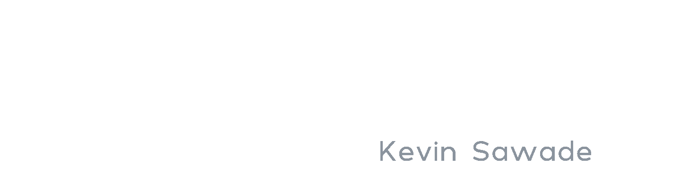

# Hi there! 👋

My name is **Kevin Sawade**. I am a theoretical chemist, currently in the final year of my PhD.

I am happy to have been able to combine my passion in chemistry and data science during my education. I 

# Education 🎓

**Diplomas**
* 2012-2015: BSc in theoretical Chemistry
* 2015-2018: MSc in theoretical Chemistry
* 2018- : PhD in theoretical Chemistry

**Publications**

For my publications please refer to my Uni homepage:

https://www.chemie.uni-konstanz.de/ag-peter/members/group-members-1/current-members/kevin-sawade/

# Skills 💪 & Knowledge 📚

**Software skills**
* Python
* Tensorflow
* Git
* HPC
* Gromacs
* Automated tests

**Scientific knowledge**
* Statistical mechanics
* Biopolymers
* Bioinformatics
* Molecular Dynamics
* Docking

**Interests**
* Spectroscopy
* Blender
* Integrated Circuits
* Prototyping
* Distributive Computing
